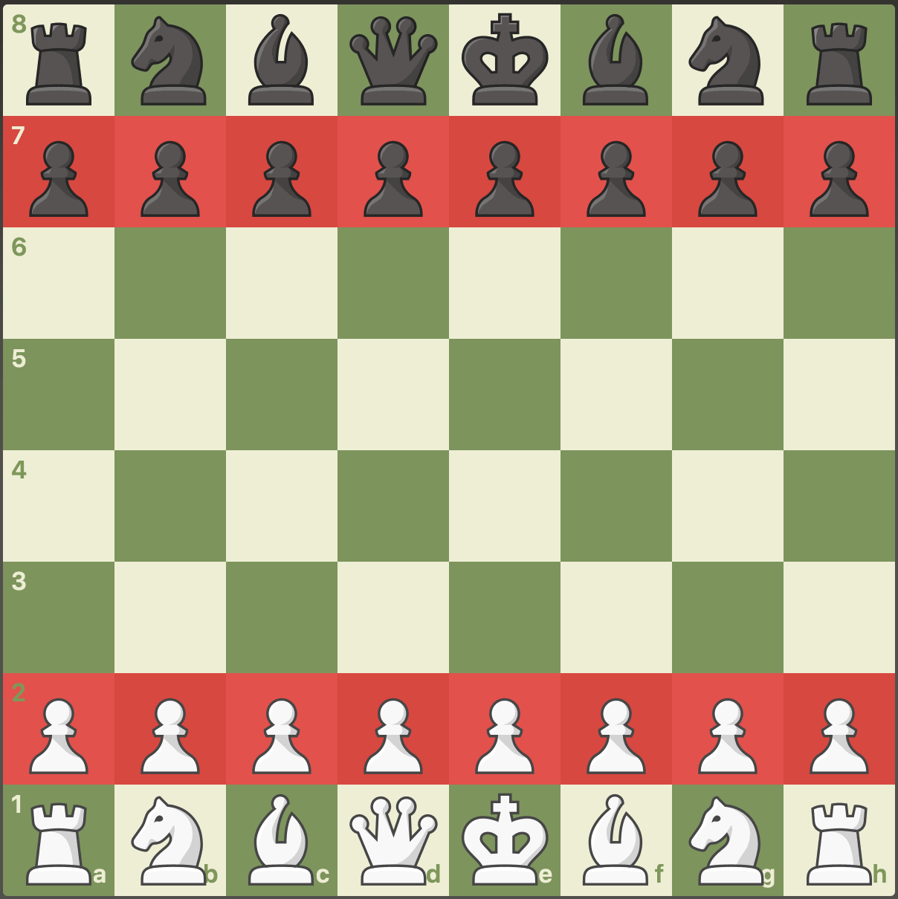

## Chess Pieces

* 8 Pawns
* 2 Bishops
  * can move diagonally
* 2 Knights (Horse)
  * Moves in an ‘L-shape,’ two squares in a straight direction, and then one square perpendicular to that.
* 2 Rooks (Elephant)
  * Moves any number of squares horizontally or vertically.
* 1 Queen
  *  Moves any number of squares diagonally, horizontally, or vertically
* 1 King
  *  Moves one square in any direction.

