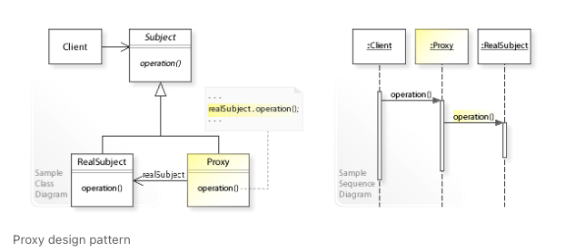

### Introduction

* Similar to Decorator pattern
* Useful to create a wrapper to cover the main object’s complexity from the client



### Implementation

#### Example

```java

public interface Internet 
{ 
	public void connectTo(String serverhost) throws Exception; 
} 

public class RealInternet implements Internet 
{ 
	@Override
	public void connectTo(String serverhost) 
	{ 
		System.out.println("Connecting to "+ serverhost); 
	} 
}

public class ProxyInternet implements Internet 
{
  private Internet internet = new RealInternet(); 
  //or
  //we can implement RealInternet class also
  //CLient will interact with ProxyInternet object

}

```

### References

* [https://www.geeksforgeeks.org/proxy-design-pattern/](https://www.geeksforgeeks.org/proxy-design-pattern/)
* [https://howtodoinjava.com/design-patterns/structural/proxy-design-pattern/](https://howtodoinjava.com/design-patterns/structural/proxy-design-pattern/)